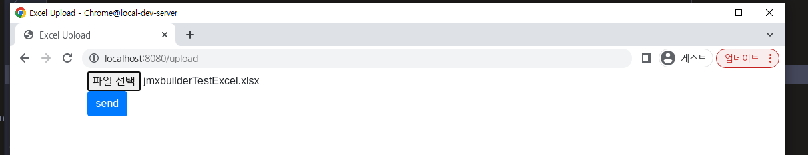
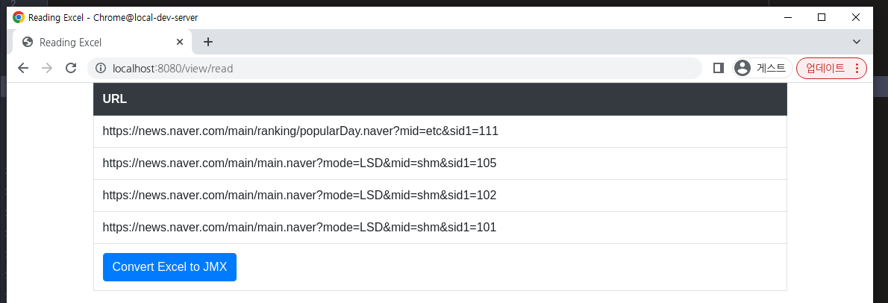
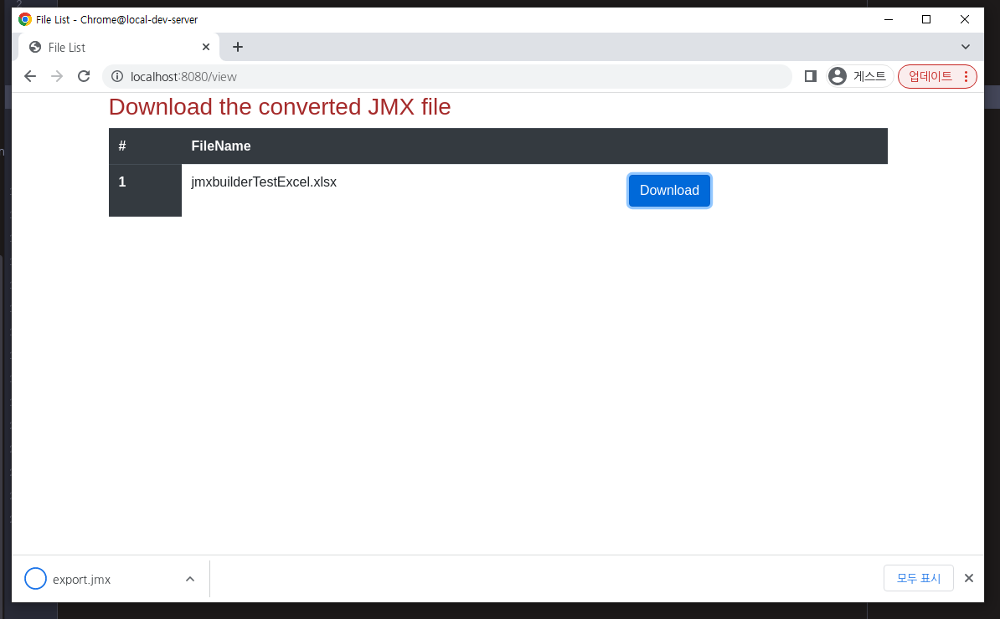
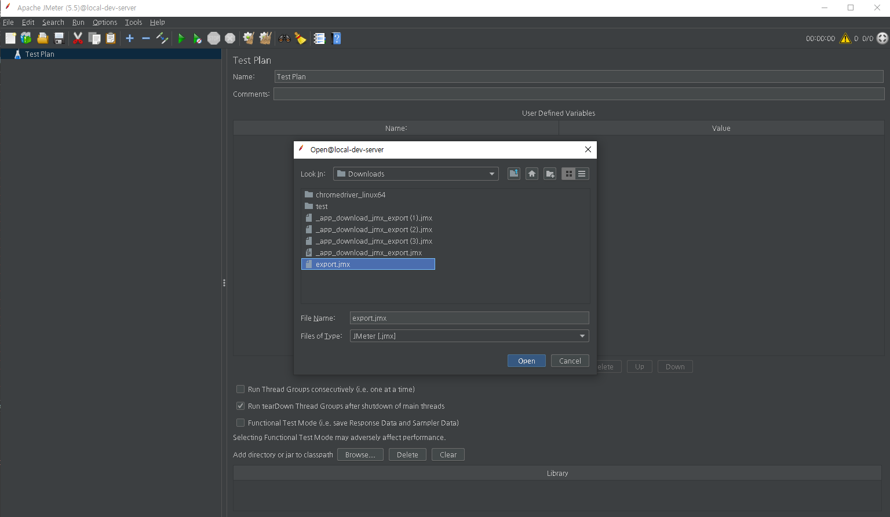
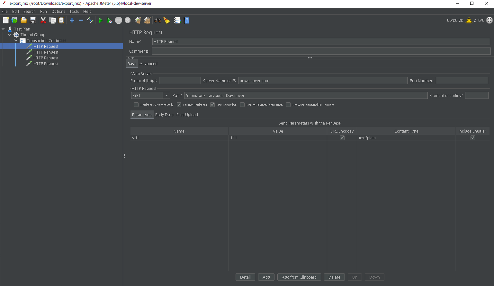

# Convert Excel To JMX

---

## Application Testing

> File Upload
>
> 

> File Read
> 
> 

> Convert Excel to JMX Download
> 
> 

> Download jmx File Using Jmter Application Open
> 
> 
> 

- Exam Excel File
  - [jmxbuilderTestExcel](jmxbuilderTestExcel.xlsx)

## Summary

For efficient and faster performance testing, URL for protocol information and parameter information are parsed.

Convert to JMX file with the URL information presented in the Excel file.

## Project explanation

Use Apache Poi library for parsing Excelfile data After that Object Mapping

Create object mapping and xml using JAXB library 

When downloading a file from View, change the extension to jmx file and download it.

## Skills

- Java "1.8.0_201"
- Spring Framework "5.3.23"
- Spring Boot "2.7.4"
- Gradle "7.5"
- Apache Poi "3.9"
- Jaxb Api "2.2.4"